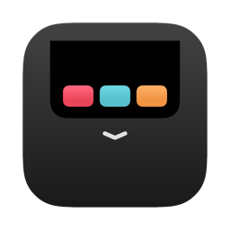
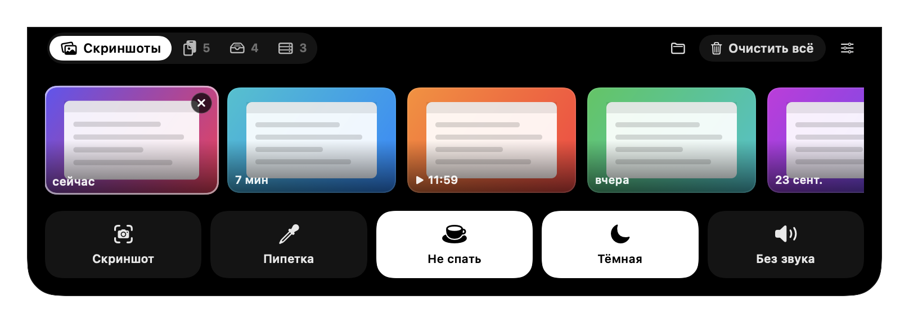
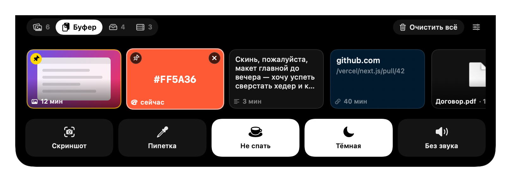
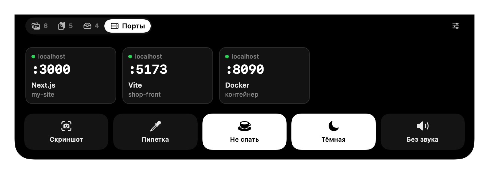

<p align="center">
  
</p>

<h1 align="center">Шторка</h1>

<p align="center">
  Панель для MacBook, которая выезжает из выреза экрана.<br>
  Скриншоты, история буфера, полка для файлов, занятые порты и быстрые кнопки.
</p>



## Установка

1. Скачайте [Shtorka.dmg](https://github.com/GitMaxm/shtorka-app/releases/latest/download/Shtorka.dmg).
2. Откройте его и перетащите «Шторка» в «Программы».
3. Откройте Шторку из «Программ». Появится окно «Файл «Шторка» не был открыт» — нажмите «Готово».
4. Откройте Системные настройки → Конфиденциальность и безопасность, пролистайте до раздела «Безопасность» и нажмите «Все равно открыть». Подтвердите паролем.

macOS 14 Sonoma или новее, Apple Silicon и Intel.

## Что умеет

Наведите курсор на верхний край экрана по центру, и шторка выедет.

- **Скриншоты**: последние снимки экрана. Перетащите в любое приложение, клик копирует.
- **Буфер**: история копирования. Клик копирует снова, нужное можно закрепить.
- **Полка**: положите файл сейчас, заберите позже.
- **Порты**: запущенные dev-серверы. Открыть в браузере или остановить.
- **Быстрые кнопки**: скриншот, пипетка, «Не спать», тёмная тема, без звука. Можно скрыть и переставить.

<p>
  
  
</p>

## Сборка из исходников

Нужны Command Line Tools (`xcode-select --install`). Swift, SwiftUI и AppKit, без зависимостей.

```bash
./build.sh             # build/Shtorka.app
./build.sh --install   # установить в /Applications и запустить
./build.sh --dmg       # собрать установщик ../Shtorka.dmg
./build.sh --selftest  # самопроверка
```

## Автор

Maxim Ivanenko, [@GitMaxm](https://github.com/GitMaxm)

## Лицензия

[MIT](LICENSE)
